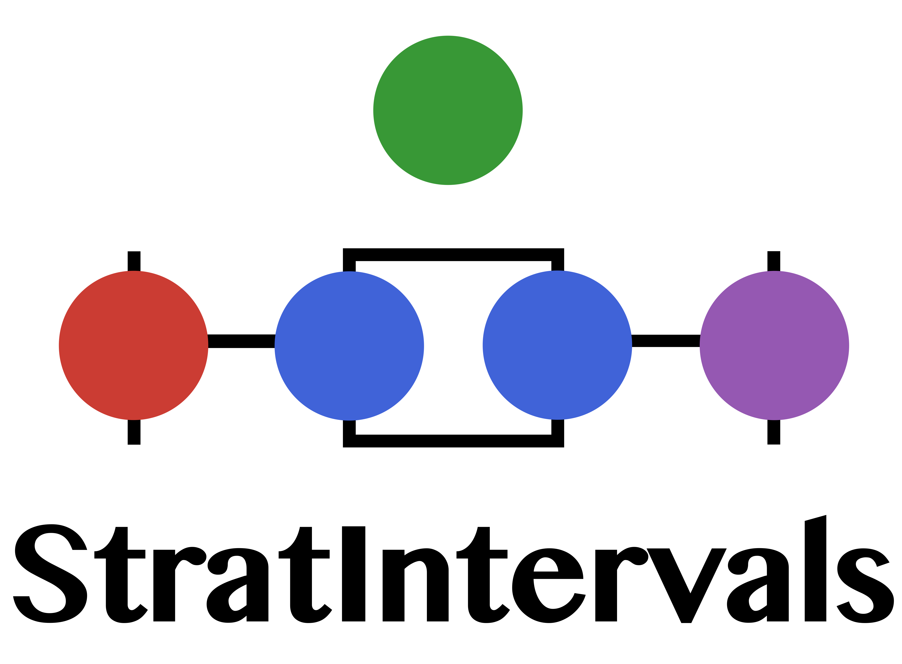

# StratIntervals </img>

[](https://github.com/gaballench/StratIntervals.jl/actions/workflows/CI.yml?query=branch%3Amain)


## Description

A Julia package for Bayesian inference of stratigraphic intervals using time occurrence data.

## Installation

For now only the github development version is available. You can install using
:

```julia
using Pkg
Pkg.add("gaballench/StratIntervals.jl")
```

## Authorship

This package was created and maintained by Gustavo A. Ballen
(@gaballench).

## Problems?

If you find a bug or unexpected behavior, please [file an
issue](https://github.com/gaballench/StratIntervals.jl/issues).
