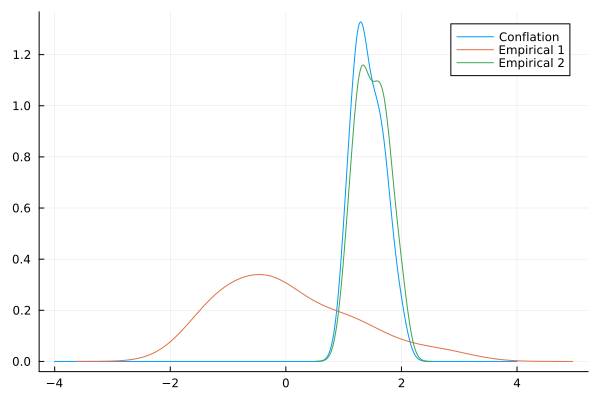

# Conflation: Combining distributions

Combining different distributions is not straitghforward (Genest and Zidek, 1986). However, the conflation of probability density functions is a useful procedure which combines them provided that each of them is independent (Hill, 2008, 2011).  Assuming that each distribution describing the same parameter is independent, we can define the composite distribution of ``\tau`` for ``M`` intervals as the conflation of individual distributions:

```math
\begin{equation}
  \begin{aligned}
    Q(\tau) = \frac{ \prod_{i=1}^{M} p_i(\tau)}{\int_{-\infty}^{\infty} \prod_{i=1}^{M} p_i(x) \mathrm{d}x}
  \end{aligned}
\end{equation}
```

Such distribution is useful e.g. when we want to build credible intervals for the time ``\tau`` of co-occurrence of stratigraphic intervals. The conceptual interpretation as follows: ``M`` different lineages as represented by their stratigraphic intervals should coexist at most for some time interval when they all were alive. As the conflation of densities is a density itself, it can be used for asking questions on the probability of co-existence of lineages during some arbitrary time interval given the distribution.

The application of conflation is however more general than the specific case where we combine different posterior predictives as the distribution of the co-occurrence of stratigraphic intervals.
Ballen and Reinales (2025) have used the method for combining distributions into secondary calibrations as well as for estimating biogeographic events in divergence time estimation. As long as we have a vector of distributions, the calculation of their conflation is straightforward:

```@repl
using Distributions
using StatsPlots
using StratIntervals

dists = product_distribution([Normal(10, 2), Normal(11, 4), Normal(8, 5)])
xx = 5:0.0001:15
yy = map(x -> conflate(dists, x), xx);
plot(xx, yy, label="Conflation")
plot!(Normal(10, 2), label="Normal(10, 2)")
plot!(Normal(11, 4), label="Normal(11, 4)")
plot!(Normal(8, 5), label="Normal(8, 5)")
savefig("conflation_example.svg");

nothing
```


It is also possible to conflate empirical distributions defined by Kernel Densities.
Supose we have two collections of values in the objects empirica1_vec and empirical2_vec _which are of the same length_, and we want to conflate them:

```@repl
using Random
using Distributions
using StatsPlots
using StratIntervals

Random.seed!(1507)

#empirical1
empirical1_vec = rand(Normal(0, 1), 20)
#empirical2
empirical2_vec = rand(Uniform(1, 2), 20)
# stack them together in a matrix, column-wise
empirical_matrix = [empirical1_vec empirical2_vec]

xx = -4:0.01:4
yy = map(x -> conflate(empirical_matrix, x), xx);

plot(xx, yy, label="Conflation")
density!(empirical1_vec, label="Empirical 1")
density!(empirical2_vec, label="Empirical 2")
savefig("conflation_empiricals_samelength.svg");

nothing
```


