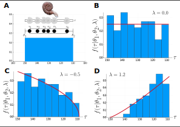
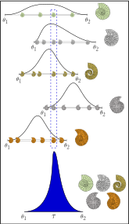

# Stratigraphic intervals and how to define them

## The `StratInterval` data structure

The data structure that is provided in the package is called [StratInterval](@ref StratIntervals.StratInterval). It provides four fields for specifying both data and priors:

- `data` is a vector of `Float64` with the age occurrences
- `θ1_prior` prior distribution for ``\theta_1``  
- `θ2_prior` prior distribution for ``\theta_2``
- `λ_prior` prior distribution for ``\lambda``

We will discuss below each of these elements.
    
## Defining a stratigraphic interval

A stratigraphic interval is a collection of time occurrences preserved in the fossil record. For instance, Let us consider the Ammonite in the Figure below, it speciated at time ``\theta_1``, lived for some time, and then became extinct at time ``\theta_2``. The pattern of preservation is governed by a quantity called ``\lambda``, which determines how likely it is to become preserved as we proceed in time.

Normally, we have access to some collection of preserved occurrences in time, but the first and last of these, called the First Appearance Datum (FAD) and Last Appearance Datum (LAD) have very little probability of being the true origination and extinction times of the species in the fossil record. If we use these quantities for measuring how long the species was living on earth, we will bias our estimates, and therefore consider FADs and LADs biaset estimators for the true origination and extinction times ``\theta_1`` and ``\theta_2``.

The plots below show different patterns of preservation in which the histograms represet the relative frequence of fossil occurrences in time. As we can see, the patterns can be quite different depending on the value of ``\lambda``. In fact, the histograms are showing collections of occurrences sampled at random from these stratigraphic intervals for fixed values of ``\theta_1``, ``\theta_2``, and ``\lambda``.    



Living Ammonite [https://doi.org/10.7875/togopic.2020.08](https://doi.org/10.7875/togopic.2020.08), fossil Ammonite [https://commons.wikimedia.org/wiki/User:Ilzolende](https://commons.wikimedia.org/wiki/User:Ilzolende).

### With "exact" data

Any method makes assumptions about the data and how these were generated. This time we will make three assumptions:

1. Preservation potential is continuous and constant through time,

2. Time occurrences are measured without error

3. Preservation of each occurrence is independent from the preservation of other occurrences. That is, occurrences are independent and identically distributed. 

In this context, "exact" data, or occurrences measured without error means that there is no uncertainty associated to the age for a given occurrence. For example, a particular fossil may have its age dated as 32.4 Ma. Neither 31, nor 33, exactly 32.4. This is of course impossible as we cannot attain infinite precision in continuous measurements, but it is at least important that we can fix the data in a given model so that we can calculate parameter values later on. As an example, we may have a vector of fossil occurrences (in Ma) for a given extinct species as follows: `[36.0, 35.8, 33.4, 33.01, 32.9]`.

But again, this is not how the fossil record works. Anyone familiar with fossils and how we tell their age knows that for the vast majority of fossil occurrences have an interval for its age, that is, we can only guess its age with intrinsic error. For example, a given fossil may be said to be from about 34.0 and 32.3 Ma, or from the Miocene, which is essentially the interval between 23.03 and 5.333 Ma. How to deal with that undesirable property of real data?

### Data with uncertainty: Intervals

Let us consider an actual example from the fossil record. We downloaded some data for the Catfish genus _Phractocephalus_ from the [Paleobiology Database](https://paleobiodb.org/). Among other data in published references, we can focus on the age information of these occurrences. These are the columns `early_interval`, `late_interval`, `max_ma`, and `min_ma`.

| occurrence_no |         accepted_name         |  early_interval | late_interval | max_ma | min_ma | midpoint_ma | interval_length |
|:-------------:|:-----------------------------:|:---------------:|:-------------:|:------:|:------:|:-----------:|:---------------:|
|    1088124    |  Phractocephalus acreornatus  |   Late Miocene  |               |  11.63 |  5.333 |    8.4815   |      6.297      |
|    1088132    |  Phractocephalus acreornatus  |    Tortonian    |               |  11.63 |  7.246 |    9.438    |      4.384      |
|    1088367    |     Phractocephalus nassi     |   Late Miocene  |               |  11.63 |  5.333 |    8.4815   |      6.297      |
|    1088377    |     Phractocephalus nassi     |    Tortonian    |               |  11.63 |  7.246 |    9.438    |      4.384      |
|    1312353    |        Phractocephalus        |  Late Oligocene |               |  27.82 |  23.03 |    25.425   |       4.79      |
|    1312539    |        Phractocephalus        |    Tortonian    |               |  11.63 |  7.246 |    9.438    |      4.384      |
|    1368948    | Phractocephalus hemiliopterus |     Laventan    |               |  13.7  |  10.9  |     12.3    |       2.8       |
|    1386572    |        Phractocephalus        |   Santacrucian  |    Friasian   |  17.4  |  15.4  |     16.4    |        2        |
|    1587033    |        Phractocephalus        |     Langhian    |               |  15.98 |  13.82 |     14.9    |       2.16      |
|    1595384    |        Phractocephalus        | Early Oligocene |               |  33.9  |  27.82 |    30.86    |       6.08      |

This shows how real-world age information is found in the literature: In the form of intervals. Quite often information comes from biostratigraphy or correlation, which uses age intervals according to the [International Chronostratigraphic Chart](https://stratigraphy.org/chart). We need to use the numerical representation of such intervals, which we find in the columns `max_ma` and `min_max`. There are two options for using these data in analytical palaeobiology: We can calculate the midpoint of the interval and pretend that it is measured without error, or we can use the interval and sample from it. This way we can use e.g. resampling techniques for incorporating the uncertainty associated to each age. 
 
## Specifying priors

Priors are distributions which describe our beliefs about possible values for the parameters of interest. For instance, if our model is a Binomial distribution with parameter ``theta``, the proportion of success, a natural choice for describing our prior knowledge on it may be the Beta distribution, which is bound to the interval ``[0,1]``, such as proportions. The specific values of ``\alpha`` and ``\beta`` will define which values of ``\theta`` are more probable. It is even possible that any value between 0 and 1 is equally likely, when ``\alpha`` and ``\beta`` are equal to 1.

Distributions are defined using the [Distributions.jl](https://juliastats.org/Distributions.jl/) package. The syntax for defining priors is as follows:

```@repl
using Distributions
using StatsPlots

param1_prior = Normal(50, 3)
pdf(param1_prior, 51.0)

plot(param1_prior)
savefig("prior.svg");

nothing
```


In the example above, we defined the prior on param1 as ``N(\mu=50, \sigma=3)``.

We normally want priors that are at least mostly with support in ``\tau \in [0, \infty)``. Also, we want to set the priors on ``\theta_1`` and ``\theta_2`` so that ``\theta_1 > \theta_2`` (because it is in Ma _before present_). Also, it is useful to set the prior on ``\lambda`` centered at 0.0 but with enough variance as to allow values between -4 and 4, which allows a great amount of different shapes.

## Collections of stratigraphic intervals

Now we have different ways of specifying species through geologic time as a probability density function with respect to ``\tau``. We can use conflation to combine these if we have multiple so that we develop a probabilistic model for the co-occurrence of these individual intervals. In other words, such distribution describes the probability of all of them co-existing at the same time.

The figure below shows the stratigraphic intervals of five different species of Ammonites. What is the distribution of having them living all at the same time, possibly co-existing in space? Such model can be used to tell the age of such co-existence, and can be used to estimate e.g. the age of fossil assemblages (blue distribution).



Ammonite drawings courtesy of [Jorge W. Moreno-Bernal](https://www.researchgate.net/profile/Jorge-Moreno-Bernal).
